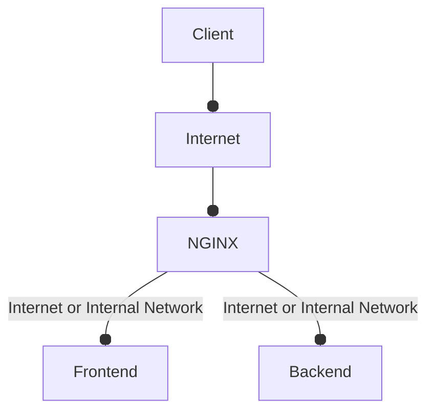

# README

## ISTL-Sports-Engine
The Italian Supreme Tennis League (ISTL, a fictitious organization) aims to unify and simplify the management of
racket-based tournaments, including, but not limited to, tennis, padel, table tennis, and similar sports.

### The distributed skeleton

#### Backend

The backend is initialized using Rails generators, a common method for generating assumed directory structures and
boilerplate code. The following command initializes a new Ruby on Rails application in the current directory using
PostgreSQL as the database, explicitly eliminating the modern deployment and infrastructure tools introduced in Rails 8.
Using various skip flags, it bypasses the Kamal deployment tool, the Solid suite of database-backed background processes
and caching, the default GitHub Actions CI configurations, and the Thruster acceleration proxy, resulting in a
"traditional" and lightweight Rails configuration.

``` bash
rails new . --database=postgresql --skip-kamal --skip-solid --skip-ci --skip-thruster
```

#### Frontend

...

### Run the distributed infrastructure

#### Docker Engine

The first prerequisite is that Docker Engine is installed on the machine.

#### NGINX

The idea behind the distributed approach is to have a flexible underlying infrastructure that allows you to easily add
new services as needed. To keep things simple, the infrastructure is very simple. It's implemented by a proxy server
that routes requests to the correct services, via an NGINX abstraction. This abstraction is the NGINX Proxy Manager.



Ideally, adding new services should be as simple as possible, and they should be conceived as Docker containers running
somewhere. The structure of this repository tries to reflect this requirement:

- The docker compose file for NPM (NGINX Proxy Manager) is located in the outermost layer
- The docker compose file for the frontend is located in the frontend folder
- The docker compose file for the backend is located in the backend folder

#### Start, Stop & Restart

Services don't have to reside on the same network. However, to keep things simple, all services are assigned to live
within the same network, which we call npm-shared. This way, NPM can visualize each service without having to manage
complex configurations for the purposes of this DEMO. This operation is handled automatically by Docker.

However, to make NPM fully operational and configurable within the local machine, we need to add additional dummy lines
to make a fictitious domain name pointing to our local machine:

- /etc/hosts file in UNIX-like operating systems
- C:Windows/System32/drivers/etc/hosts file in Windows operating systems


``` text
...
127.0.0.1       istl.distributed-backend.local
127.0.0.1       istl.distributed-frontend.local
...
```

This way, the names istl.distributed-backend.local and istl.distributed-frontend.local can be used by NPM as valid
domain names. **Remember to start your Docker engine before proceeding! For Windows users make sure to execute 
the next script lines using Git Bash or similar.**

Once this is done it is sufficient to execute ./distributed.sh script as follows:

``` bash
./distributed.sh start   # To start the infrastructure
./distributed.sh stop    # To stop the infrastructure
./distributed.sh restart # To stop and then start again the infrastructure
```

Once the infrastructure is up and running, NPM can be configured at http://localhost:81. A default user is created
automatically:

- INITIAL_ADMIN_EMAIL: npm@example.com 
- INITIAL_ADMIN_PASSWORD: password

So, for each new service you add, simply configure a new proxy (add Proxy). For the backend service:

- Domain Names: istl.distributed-backend.local
- Forward Hostname: distributed-backend
- Forward Port: 3000

For the frontend service:

- Domain Names: istl.distributed-frontend.local
- Forward Hostname: distributed-frontend
- Forward Port: 80

### Description

Frontend can be reached via http://istl.distributed-frontend.local.
There are already registered users and a few tournaments are already been played.

- Player 1:
  - username: mario@gmail.com
  - password: password

- Player 2:
  - username: donald@gmail.com
  - password: password

- Player 3:
  - username: alfonso@gmail.com
  - password: password

- Player 4:
  - username: gabriel@gmail.com
  - password: password

- Admin (only for admin panel, more info below):
  - username: admin@admin.com
  - password: Adm1ni$strat0r

- Organizer
  - username: org@org.com
  - password: password

- Referee (1):
  - username: ref1@ref.com
  - password: password

- Referee (2):
  - username: ref2@ref.com
  - password: password

The admin panel is accessible only to the admin user, which can be found at http://istl.distributed-backend.local/admin.
No sign-up is required, as admin users are created through a special process (i.e., created by the machine owner via the
Rails console).
